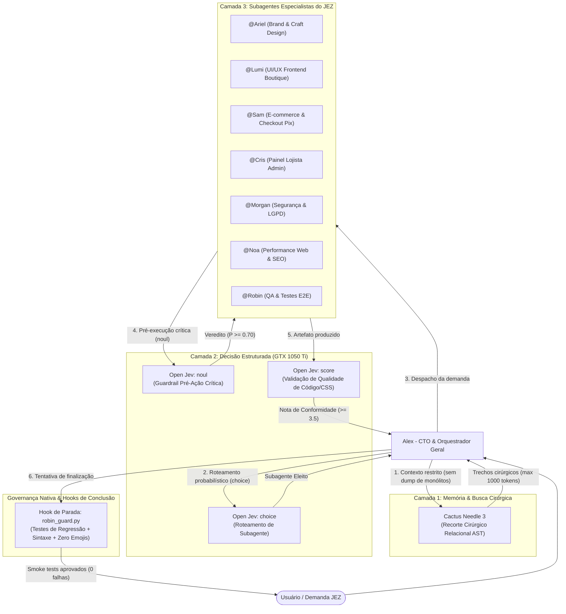

# AGENTS.md — Governança da Arquitetura Tri-Camada (JEZ Collections)

Este documento estabelece as **diretrizes mandatórias e regras de governança** para a LLM Orquestradora e os Subagentes Especialistas da **JEZ Collection**, integrando o ecossistema JEV (**Cactus Needle 3 + Open Jev Local na GTX 1050 Ti + Subagentes**) de forma nativa e persistente.

---

## 1. Princípio Fundamental: Separação Rígida de Responsabilidades



1. **A LLM NUNCA toma decisões críticas de segurança ou roteamento por texto livre.**
2. **A memória NUNCA é sobrecarregada com arquivos brutos sem filtro (Proibição de Context Dumping).**
3. **O Open Jev NUNCA gera texto livre; retorna probabilidades tipadas calibradas na GTX 1050 Ti.**
4. **Nenhum agente ou subagente abre navegador visual. A verificação visual é atribuição exclusiva do usuário.**
5. **O encerramento de qualquer tarefa é interceptado pelo Hook de Parada de Robin (`robin_guard.py`). Se houver teste quebrado, erro sintático ou emoji na base, a entrega é automaticamente bloqueada.**

---

## 2. Como Acionar o Ecossistema JEV (CLI e MCP)

Para garantir resiliência contra reinicializações do computador e economia total de VRAM (0 VRAM quando ocioso), o ecossistema JEV funciona sob demanda via CLI nativo no `$PATH` ou via protocolo MCP (Model Context Protocol):

### A. Ferramenta CLI Unificada (`jev`)
Disponível diretamente no terminal do sistema:
* **Busca Cirúrgica (Needle 3):**
  ```bash
  jev needle "query_aqui" --scope "site/app.js,site/admin.js" --max-tokens 1000
  ```
* **Roteamento de Especialista (Open JEV Choice):**
  ```bash
  jev choice "Descrição da demanda solicitada pelo usuário"
  ```
* **Guardrail Pré-Ação Crítica (Open JEV Noul):**
  ```bash
  jev noul "Ação planejada ou comando a rodar" --hypothesis "A ação é segura e não causa quebras" --threshold 0.70
  ```
* **Avaliação de Qualidade e Conformidade (Open JEV Score):**
  ```bash
  jev score --file "site/css/tokens.css" --rubric "Design tokens boutique, sem regras conflitantes" --threshold 3.5
  ```

### B. Servidor MCP (`open-jev`)
Configurado em `~/.gemini/config/mcp_config.json`:
* `needle3_search`: Retorna blocos AST relacionais.
* `openjev_choice`: Elege a persona especialista.
* `openjev_noul`: Retorna booleano de validação de segurança.
* `openjev_score`: Retorna nota calibrada de 1.0 a 5.0.

---

## 3. Matriz de Especialistas (Subagentes da JEZ Collection)

| Subagente | Arquivo de Persona | Especialidade Principal | Quando Acionar |
| :--- | :--- | :--- | :--- |
| **@Alex** | [`./personas/alex_cto.md`](./personas/alex_cto.md) | CTO & Arquiteto Líder | Arquitetura geral, code reviews, decisões estruturais e coordenação técnica. |
| **@Ariel** | [`./personas/ariel_brand_art_direction.md`](./personas/ariel_brand_art_direction.md) | Direção de Arte & Craft Design | Identidade visual artesanal, texturas têxteis e combate ao design genérico de IA. |
| **@Lumi** | [`./personas/lumi_ui_ux_frontend.md`](./personas/lumi_ui_ux_frontend.md) | UI/UX & Frontend Boutique | Design system, tokens de CSS, componentes mobile-first e micro-interações. |
| **@Sam** | [`./personas/sam_ecommerce_payments.md`](./personas/sam_ecommerce_payments.md) | E-Commerce & Checkout | Regras de frete (Correios/Melhor Envio), pronta entrega vs encomenda e Pix/Cartão. |
| **@Cris** | [`./personas/cris_admin_merchant.md`](./personas/cris_admin_merchant.md) | Experiência do Lojista (Admin) | Painel simplificado da Jéssica, fluxo de status de pedidos e usabilidade no celular. |
| **@Morgan** | [`./personas/morgan_security_privacy.md`](./personas/morgan_security_privacy.md) | Cibersegurança & LGPD | Blindagem de Firestore rules, tokenização PCI-DSS e proteção de PII de clientes. |
| **@Noa** | [`./personas/noa_performance_seo.md`](./personas/noa_performance_seo.md) | Performance & SEO | Core Web Vitals, otimização de imagens de alta resolução e Open Graph social. |
| **@Robin** | [`./personas/robin_qa_regression.md`](./personas/robin_qa_regression.md) | QA & Guardião de Testes | Testes E2E, suíte de regressão (smoke_test.js) e guardião de paradas. |

---

## 4. Protocolos Mandatórios do Pipeline JEV

### Protocolo 1: Proibição de Context Dumping (Needle 3)
- O orquestrador e subagentes estão **terminantemente proibidos** de carregar arquivos monólitos inteiros (`site/admin.js`, `site/app.js`, `site/styles.css`) no contexto sem necessidade cirúrgica.
- **Toda inspeção técnica DEVE utilizar `jev needle`**:
  * `max_tokens`: Entre **500 e 1.200 tokens**.
  * `scope`: Especificar os arquivos alvo para não inflacionar o grafo.

### Protocolo 2: Roteamento Estruturado de Especialista (`choice`)
- Toda demanda deve ser roteada via `jev choice "..."` para determinar qual especialista deve liderar a solução.

### Protocolo 3: Guardrail de Pré-Execução Crítica (`noul`)
- **Ações Críticas Obrigatórias para Bloqueio:**
  * Modificação ou deleção em regras de segurança (`firestore.rules`, `firebase.json`).
  * Deploys ou alterações destrutivas em banco de dados / Firestore.
  * Comandos de remoção de arquivos (`rm`, `git reset --hard`).
- Se `jev noul` retornar bloqueio (P < 0.70), a ação NÃO pode ser executada.

### Protocolo 4: Validação de Código e Estilos (`score`)
- Alterações em design system (`tokens.css`), regras de negócio de pedidos ou componentes devem ser avaliadas via `jev score` com nota mínima de 3.5/5.0.

### Protocolo 5: Proibição de Navegadores Visuais Automatizados
- **Nenhum agente, subagente ou rotina de teste deve acionar o navegador visualmente (via browser subagent ou Puppeteer headful)**.
- O uso de navegador visual gasta tokens excessivos e causa lentidão desnecessária.
- As conferências visuais e inspeções de layout são de **responsabilidade exclusiva da usuária humana**.

### Protocolo 6: Guardião de Parada Automatizado (Robin QA Stop Hook)
- O hook de parada em `.agents/hooks.json` executa `.agents/scripts/robin_guard.py` a cada tentativa do agente de concluir o turno.
- O hook valida automaticamente:
  1. Se algum arquivo em `site/` foi alterado.
  2. Ausência de emojis em arquivos de código/UI (diretriz Zero Emojis).
  3. Sintaxe JavaScript válida (`node -c`).
  4. Execução completa da suíte de regressão (`node site/tests/smoke_test.js`).
- Se qualquer um dos itens falhar, o sistema rejeita o encerramento e força o agente a corrigir a falha.

---

## 5. Regras Invioláveis de Marca e Identidade Visual (Ariel & Lumi)
1. **Zero Emojis na Interface e no Código:** Proibido uso de emojis em botões, títulos, alertas ou logs do e-commerce. Ícones devem ser exclusivamente vetoriais SVG ou texto tipográfico puro.
2. **Zero Badges "Pílula" Flutuantes:** Veto absoluto a botões ou badges ovais com sombras difusas genéricas. Utilizar acabamento de etiquetas têxteis costuradas (*woven labels*) com borda pespontada (`dashed border`).
3. **Tokens Oficiais da Paleta:**
   * `--color-dark: #23192d` (Aubergine Profundo)
   * `--color-primary: #FD0A54` (Magenta Vibrante)
   * `--color-secondary: #F57576` (Coral Suave)
   * `--color-accent: #FEBF97` (Pêssego Têxtil)
   * `--color-bg-light: #F5ECB7` (Creme de Algodão Cru)
