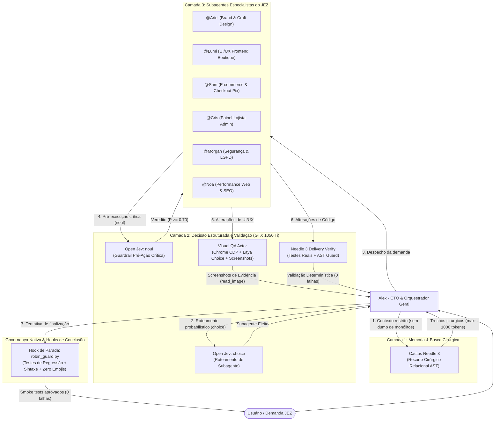

# AGENTS.md — Governança da Arquitetura Tri-Camada (JEZ Collections)

Este documento estabelece as **diretrizes mandatórias e regras de governança** para a LLM Orquestradora e os Subagentes Especialistas da **JEZ Collection**, integrando o ecossistema JEV (**Cactus Needle 3 + Open Jev Local na GTX 1050 Ti + Subagentes**) de forma nativa e persistente.

---

## 1. Princípio Fundamental: Separação Rígida de Responsabilidades


```mermaid
flowchart TD
    User([Usuário / Demanda JEZ]) --> Orchestrator[Alex - CTO & Orquestrador Geral]
    
    subgraph Camada1["Camada 1: Memória & Busca Cirúrgica"]
        Needle3["Cactus Needle 3\n(Recorte Cirúrgico Relacional AST)"]
    end
    
    subgraph Camada2["Camada 2: Decisão Estruturada e Validação (GTX 1050 Ti)"]
        OpenJevChoice["Open Jev: choice\n(Roteamento de Subagente)"]
        OpenJevNoul["Open Jev: noul\n(Guardrail Pré-Ação Crítica)"]
        VisualQAActor["Visual QA Actor\n(Chrome CDP + Laya Choice + Screenshots)"]
        DeliveryVerify["Needle 3 Delivery Verify\n(Testes Reais + AST Guard)"]
    end
    
    subgraph Camada3["Camada 3: Subagentes Especialistas do JEZ"]
        Ariel["@Ariel (Brand & Craft Design)"]
        Lumi["@Lumi (UI/UX Frontend Boutique)"]
        Sam["@Sam (E-commerce & Checkout Pix)"]
        Cris["@Cris (Painel Lojista Admin)"]
        Morgan["@Morgan (Segurança & LGPD)"]
        Noa["@Noa (Performance Web & SEO)"]
    end

    subgraph Gates["Governança Nativa & Hooks de Conclusão"]
        HookStop["Hook de Parada: robin_guard.py\n(Testes de Regressão + Sintaxe + Zero Emojis)"]
    end

    Orchestrator -- "1. Contexto restrito (sem dump de monólitos)" --> Needle3
    Needle3 -- "Trechos cirúrgicos (max 1000 tokens)" --> Orchestrator
    
    Orchestrator -- "2. Roteamento probabilístico (choice)" --> OpenJevChoice
    OpenJevChoice -- "Subagente Eleito" --> Orchestrator
    
    Orchestrator -- "3. Despacho da demanda" --> Camada3
    
    Camada3 -- "4. Pré-execução crítica (noul)" --> OpenJevNoul
    OpenJevNoul -- "Veredito (P >= 0.70)" --> Camada3
    
    Camada3 -- "5. Alterações de UI/UX" --> VisualQAActor
    VisualQAActor -- "Screenshots de Evidência (read_image)" --> Orchestrator

    Camada3 -- "6. Alterações de Código" --> DeliveryVerify
    DeliveryVerify -- "Validação Determinística (0 falhas)" --> Orchestrator

    Orchestrator -- "7. Tentativa de finalização" --> HookStop
    HookStop -- "Smoke tests aprovados (0 falhas)" --> User
```

1. **A LLM NUNCA toma decisões críticas de segurança ou roteamento por texto livre.**
2. **A memória NUNCA é sobrecarregada com arquivos brutos sem filtro (Proibição de Context Dumping).**
3. **O Open Jev NUNCA gera texto livre; retorna probabilidades tipadas calibradas na GTX 1050 Ti.**
4. **Toda e qualquer alteração com impacto na interface visual do usuário (UI/UX) DEVE ser conferida via Visual QA Actor em modo headless, gerando screenshots e sendo inspecionada diretamente via `read_image` por @Lumi ou @Alex antes da entrega.**
5. **O encerramento de qualquer tarefa é interceptado pelo Hook de Parada de Qualidade (`robin_guard.py`). Se houver teste quebrado, erro sintático ou emoji na base, a entrega é automaticamente bloqueada.**

---

## 2. Como Acionar o Ecossistema JEV (CLI e MCP)

Para garantir resiliência contra reinicializações do computador e economia total de VRAM (0 VRAM quando ocioso), o ecossistema JEV funciona sob demanda via CLI nativo no `$PATH` ou via protocolo MCP (Model Context Protocol):

### A. Ferramenta CLI Unificada (`jev`)
Disponível diretamente no terminal do sistema:
* **Busca Cirúrgica (Needle 3):**
  ```bash
  jev needle "query_aqui" --scope "site/app.js,site/admin.js" --max-tokens 1000
  ```
* **Roteamento de Especialista (Open JEV Choice):**
  ```bash
  jev choice "Descrição da demanda solicitada pelo usuário"
  ```
* **Guardrail Pré-Ação Crítica (Open JEV Noul):**
  ```bash
  jev noul "Ação planejada ou comando a rodar" --hypothesis "A ação é segura e não causa quebras" --threshold 0.70
  ```
* **Servidor HTTP Local para QA Visual (Porta 8080):**
  ```bash
  node "/home/maiteuxzanela/deepseek harness/server_jez.js"
  ```
* **Automação e Inspeção Visual (Visual QA Actor):**
  ```bash
  node "/home/maiteuxzanela/deepseek harness/tools/visual_qa_actor.js" "clicar no card hero Tote Bag Cherry" "adicionar a sacola" "digitar o cep 39400-000"
  ```

### B. Servidor MCP (`open-jev`)
Configurado em `~/.gemini/config/mcp_config.json`:
* `needle3_search`: Retorna blocos AST relacionais cirúrgicos (500 a 1.200 tokens).
* `openjev_choice`: Elege a persona especialista a partir do roster formal.
* `openjev_noul`: Avaliação opcional de segurança (threshold ≥ 0.78).
* `needle_verify_delivery`: Validação 100% determinística de entrega (1º Pytest em Chunks -> 2º NeedleASTGuard -> 3º NeedleASTScreener).

---

## 3. Matriz de Especialistas (Subagentes da JEZ Collection)

O orquestrador Alex opera com autonomia plena de desenvolvimento, coordenação e refatoração. Em conformidade com as Diretrizes Globais (~/.dsh/AGENTS.md), quando a tarefa exigir colaboração entre múltiplos especialistas, ela opera compulsoriamente via plugin **AgentTeams** com DAG e mailbox durável.

| Subagente | Arquivo de Persona | Especialidade Principal | Quando Acionar |
| :--- | :--- | :--- | :--- |
| **@Alex** | [`./personas/alex_cto.md`](./personas/alex_cto.md) | CTO & Arquiteto Líder | Arquitetura geral, code reviews, decisões estruturais e coordenação técnica. |
| **@Ariel** | [`./personas/ariel_brand_art_direction.md`](./personas/ariel_brand_art_direction.md) | Direção de Arte & Craft Design | Identidade visual artesanal, texturas têxteis e combate ao design genérico de IA. |
| **@Lumi** | [`./personas/lumi_ui_ux_frontend.md`](./personas/lumi_ui_ux_frontend.md) | UI/UX & Frontend Boutique | Design system, tokens de CSS, componentes mobile-first, micro-interações e testes visuais. |
| **@Sam** | [`./personas/sam_ecommerce_payments.md`](./personas/sam_ecommerce_payments.md) | E-Commerce & Checkout | Regras de frete (Correios/Melhor Envio), pronta entrega vs encomenda, Pix/Cartão e testes de fluxo. |
| **@Cris** | [`./personas/cris_admin_merchant.md`](./personas/cris_admin_merchant.md) | Experiência do Lojista (Admin) | Painel simplificado da Jéssica, fluxo de status de pedidos e usabilidade no celular. |
| **@Morgan** | [`./personas/morgan_security_privacy.md`](./personas/morgan_security_privacy.md) | Cibersegurança & LGPD | Blindagem de Firestore rules, tokenização PCI-DSS e proteção de PII de clientes. |
| **@Noa** | [`./personas/noa_performance_seo.md`](./personas/noa_performance_seo.md) | Performance & SEO | Core Web Vitals, otimização de imagens de alta resolução e Open Graph social. |
| *(Arquivo)* **@Robin** | [`./personas/robin_qa_regression.md`](./personas/robin_qa_regression.md) | *[Descontinuada / Integrada]* | Suíte de regressão (smoke_test.js) transferida para os desenvolvedores e validada via needle_verify_delivery. |

---

## 4. Protocolos Mandatórios do Pipeline JEV

### Protocolo 1: Proibição de Context Dumping (Needle 3)
- O orquestrador e subagentes estão **terminantemente proibidos** de carregar arquivos monólitos inteiros (`site/admin.js`, `site/app.js`, `site/styles.css`) no contexto sem necessidade cirúrgica.
- **Toda inspeção técnica DEVE utilizar `jev needle`**:
  * `max_tokens`: Entre **500 e 1.200 tokens**.
  * `scope`: Especificar os arquivos alvo para não inflacionar o grafo.

### Protocolo 2: Orquestração de Squad via AgentTeams
- O orquestrador tem autonomia para desenvolver e refatorar diretamente. Sempre que houver demanda por debate ou colaboração de squad (ex: @Lumi para design/componentes, @Sam para checkout/pagamentos), deve instanciar a equipe via plugin **AgentTeams** com DAG e mailbox durável.

### Protocolo 3: Guardrail de Pré-Execução Crítica (`noul`)
- **Ações Críticas Obrigatórias para Bloqueio:**
  * Modificação ou deleção em regras de segurança (`firestore.rules`, `firebase.json`).
  * Deploys ou alterações destrutivas em banco de dados / Firestore.
  * Comandos de remoção de arquivos (`rm`, `git reset --hard`).
- Se `jev noul` retornar bloqueio (P < 0.70), a ação NÃO pode ser executada.

### Protocolo 4: Validação Determinística de Código (`needle_verify_delivery`)
- O validador antigo baseado em notas heurísticas de score foi integralmente substituído pelo pipeline determinístico unificado `needle_verify_delivery`.
- Toda entrega envolvendo alteração ou criação de código deve ser submetida e aprovada pelo pipeline:
  1. Suíte de testes determinísticos reais (Pytest / Node.js smoke tests);
  2. Needle 3 AST Guardrail (Camada 1: anti-mock, SQL Injection, eval perigoso, segredos expostos);
  3. Needle 3 AST Screener (Camada 2: alertas estruturais de tipagem, exceções e contratos).

### Protocolo 5: Inspeção e Validação Visual Automatizada (`visual_qa_actor`)
- **Gatilho Mandatório:** Toda e qualquer alteração de código ou estilo que impacte a interface gráfica (`index.html`, `atelie.html`, `styles.css`, `admin.css`, `tokens.css`, componentes do catálogo, gaveta da sacola, modais de checkout ou painel administrativo) **DEVE** passar pela conferência visual automatizada via ferramenta `visual_qa_actor` antes da conclusão do turno.
- **Arquitetura da Ferramenta:**
  * **Localização Oficial:** `/home/maiteuxzanela/deepseek harness/tools/visual_qa_actor.js`
  * **Servidor HTTP Local:** Ativo em `http://127.0.0.1:8080/` servindo `/mnt/94CCB337CCB3130A/JEZ collections/site/` via `node "/home/maiteuxzanela/deepseek harness/server_jez.js"`.
  * **Execução Headless:** Chrome Headless via Chrome DevTools Protocol (CDP na porta 9222), garantindo performance ultrarrápida sem janelas gráficas intrusivas no desktop.
  * **Resolução Semântica por IA (Laya Choice):** Os comandos de navegação são passados em **linguagem natural pura** (ex: *"clicar no card de destaque hero Tote Bag Cherry"*, *"digitar o cep 39400-000"*, *"clicar na aba Acervo"*). A cada passo, o modelo local **Laya** (`openjev_choice`) escaneia os elementos interativos visíveis do DOM e elege o alvo correto probabilisticamente, dispensando seletores CSS rígidos e frágeis.
  * **Evidências Fotográficas:** A cada ação executada, o actor captura e persiste uma screenshot em alta fidelidade no diretório `screenshots/passo_<N>_<elem>.png`.
- **Como Executar o Fluxo de QA Visual:**
  1. **Esvaziamento Prévio Obrigatório da Pasta de Screenshots:**
     Antes de invocar o `visual_qa_actor.js`, a pasta `screenshots/` **DEVE ser esvaziada** para evitar acúmulo de fotos residuais entre sessões e garantir que a auditoria avalie estritamente os artefatos da rodada corrente:
     ```bash
     rm -f screenshots/*
     ```
  2. **Certificar-se de que o servidor local está ativo:**
     ```bash
     curl -s -o /dev/null -w "%{http_code}" http://127.0.0.1:8080/index.html || node "/home/maiteuxzanela/deepseek harness/server_jez.js" &
     ```
  3. **Disparar os comandos em linguagem natural via CLI:**
     ```bash
     node "/home/maiteuxzanela/deepseek harness/tools/visual_qa_actor.js" \
       "clicar no card de destaque hero Tote Bag Cherry" \
       "clicar no botao Comprar Peca" \
       "digitar o cep 39400-000"
     ```
  4. **Disparar testes no Ateliê (`atelie.html`):**
     Executar apontando `url: 'http://127.0.0.1:8080/atelie.html'`, fornecendo comandos de autenticação e navegação:
     ```bash
     node -e '
     const VisualQAActor = require("/home/maiteuxzanela/deepseek harness/tools/visual_qa_actor.js");
     const actor = new VisualQAActor({ url: "http://127.0.0.1:8080/atelie.html" });
     actor.runCommands([
       "digitar a senha atelie2026 no campo Chave de Acesso",
       "clicar no botao Entrar no Atelie",
       "clicar na aba Acervo"
     ]).then(console.log);'
     ```
- **Inspeção Visual Obrigatória com `read_image` (@Lumi ou @Alex):**
  * Geradas as screenshots em `screenshots/`, a subagente especialista em UI/UX (@Lumi) ou o orquestrador (@Alex) **DEVE** invocar a ferramenta `read_image` sobre as imagens para conferência ótica real.
  * **Quality Gate Visual Inegociável:**
    - [ ] **Paleta Oficial:** Uso estrito das variáveis CSS (`#23192d`, `#FD0A54`, `#F57576`, `#FEBF97`, `#F5ECB7`).
    - [ ] **Zero Emojis:** Veto absoluto a emojis na interface, botões, modais ou mensagens toast.
    - [ ] **Zero Pills:** Veto a botões ou badges ovais com sombras difusas. Todas as tags devem utilizar acabamento de etiquetas têxteis costuradas (*woven labels*) com borda pespontada (`dashed border`).
    - [ ] **Integridade e Proporção:** Verificar alinhamento vertical, ausência de overflow horizontal e respiro visual em telas móveis e desktop.
    - [ ] **Feedback de Interação:** Verificar estados ativos de modais, drawers, inputs preenchidos e destaques.

### Protocolo 6: Guardião de Parada Automatizado (Quality Stop Hook)
- O hook de parada em `.agents/hooks.json` executa `.agents/scripts/robin_guard.py` a cada tentativa do agente de concluir o turno.
- O hook valida automaticamente:
  1. Se algum arquivo em `site/` foi alterado.
  2. Ausência de emojis em arquivos de código/UI (diretriz Zero Emojis).
  3. Sintaxe JavaScript válida (`node -c`).
  4. Execução completa da suíte de regressão (`node site/tests/smoke_test.js`).
- Se qualquer um dos itens falhar, o sistema rejeita o encerramento e força o agente a corrigir a falha.

---

## 5. Regras Invioláveis de Marca e Identidade Visual (Ariel & Lumi)
1. **Zero Emojis na Interface e no Código:** Proibido uso de emojis em botões, títulos, alertas ou logs do e-commerce. Ícones devem ser exclusivamente vetoriais SVG ou texto tipográfico puro.
2. **Zero Badges "Pílula" Flutuantes:** Veto absoluto a botões ou badges ovais com sombras difusas genéricas. Utilizar acabamento de etiquetas têxteis costuradas (*woven labels*) com borda pespontada (`dashed border`).
3. **Tokens Oficiais da Paleta:**
   * `--color-dark: #23192d` (Aubergine Profundo)
   * `--color-primary: #FD0A54` (Magenta Vibrante)
   * `--color-secondary: #F57576` (Coral Suave)
   * `--color-accent: #FEBF97` (Pêssego Têxtil)
   * `--color-bg-light: #F5ECB7` (Creme de Algodão Cru)
